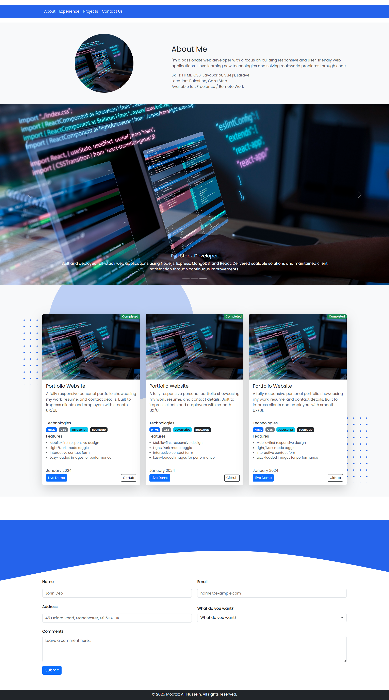

# Personal Portfolio Website

## Overview

This project is a responsive personal portfolio website developed to showcase my skills, experience, and projects as a web developer.

The website provides visitors with information about my background, featured projects, technical skills, and contact details through a modern and clean user interface.

---

## Features

- Responsive Design
- Modern User Interface
- About Me Section
- Featured Projects Showcase
- Image Slider / Hero Section
- Contact Form
- Footer with Copyright
- Mobile-Friendly Layout

---

## Technologies Used

- HTML5
- CSS3
- JavaScript
- Bootstrap 5

---

## Project Structure

```text
github-training-project
│
├── css/
│   └── style.css
│
├── fonts/
│
├── images/
│   ├── profile.jpg
│   ├── project-1.jpg
│   └── ...
│
├── js/
│   └── main.js
│
├── index.html
│
└── README.md
```

---

## Getting Started

### Clone Repository

```bash
git clone https://github.com/your-username/github-training-project.git
```

### Open Project

Simply open:

```text
index.html
```

in your browser.

---

## Screenshots

### Portfolio




---

## Future Improvements

- Dark Mode
- Project Filtering
- Blog Section
- Backend Contact System
- Animations Enhancement

---

## Author

Abdulrahman Albatta

Web Developer

GitHub: https://github.com/your-username